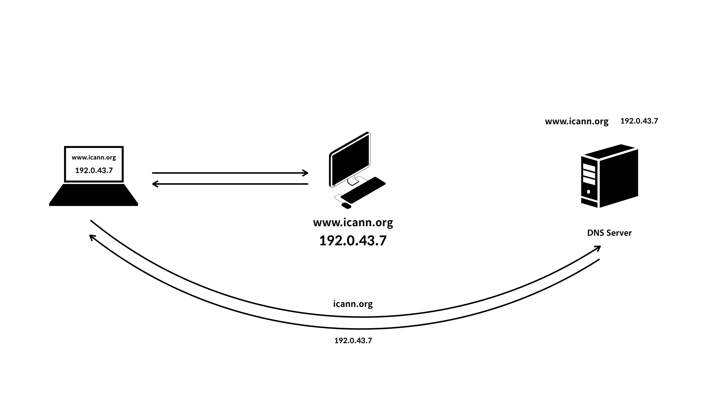
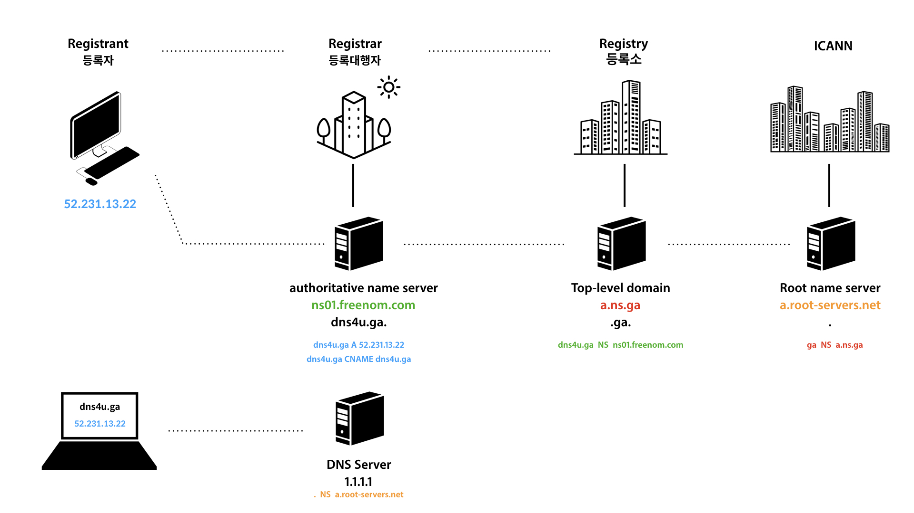
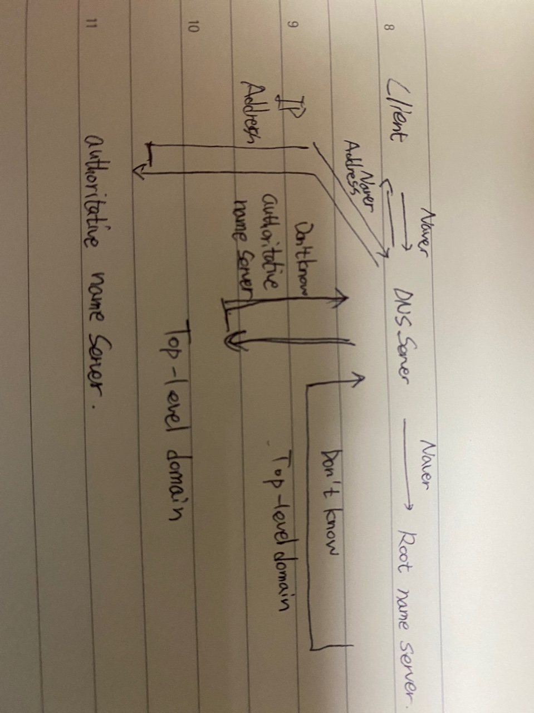

# CS
## Network
---
 자료, 내용 첨부 : https://www.youtube.com/playlist?list=PLuHgQVnccGMCI75J-rC8yZSVGZq3gYsFp  

#### host 
- 인터넷에 연결된 컴퓨터 한대 한대를 지칭한다.

#### DNS Server
- 수많은 IP주소와 도메인이 저장되어있는 Server이다.

#### hosts
- hosts 파일에 IP주소와 도메인 이름을 저장해서, 저장된 도메인 이름을 통해 다른 host에 접근할 수 있다.

- 모두가 내가 저장한 Domain-IP 설정으로 접속하는게 아닌 로컬 설정과 같다.

- 리눅스에서 hosts 파일의 localhost를 이유 모르고 바꿨었는데 주의 할 필요가 있었다.

#### Before DNS
- hosts 설정으로 Domain으로 접속(로컬단)
- 다같이 같은 도메인으로 접속하길, IP가 바뀌면 해당 도메인의 IP만 재설정 해주면 사용자가 혼동없이 사용하길 원함.
- Stanford Research Institute에서 전세계 hosts파일을 관리했는데, 인터넷이 커지면서 유지, 갱신에 큰 시간과 비용이 사용됨.

#### Ater DNS(Domain Name System)

1. hosts 파일 X
2. DNS Server 접속 요청 응답
3. 해당 웹사이트 접속 
-> File이 Server로 변경하며 간소화, 신속화

#### Public DNS
- 통신사가 IPS(Internet Service Provider)를 자동 제공
- 통신사가 내 정보를 알수 없기를 원하는 경우가 생김
- 기존 DNS Server보다 빠른 Server를 원함
- Public DNS는 검색으로 찾아볼 수 있음.

#### Domain Name Structure

1. Root DNS Server : Top-Level Server를 알고 있어야한다.
2. Top-Level Server : Second-Level Server를 알고 있어야 한다.
3. Second-Level Server :sub Server를 알고 있어야 한다.
4. sub : 해당 IP주소를 알려준다.

- 순서대로 1->2->3->4로 정보를 전달하여 요청한 정보를 찾는다.

#### Domain Proccess

- ICANN(Root name server)
- Registry (Top-Level domain)
- Registrar (authoritative server)
- Registrant(해당 IP)
- Recode Type : A(Address), NS(Name Server)

1. Client가 Naver요청
2. Client 요청을 DNS Server가 받는다.
3. DNS 서버가 Root Name Server로 요청을 전송한다.
4. Top-Level Domain의 정보를 갖고있는 Root Name Server가 요청을 전달한다.
5. authoritative name server의 정보를 갖고있는 Top-Level Domain이 요청을 전달한다.
6. authoritative name server 해당 IP를 응답한다.
7. 응답받은 해당 IP를 DNS Server가 Client에게 전달해서 IP주소를 알려준다.