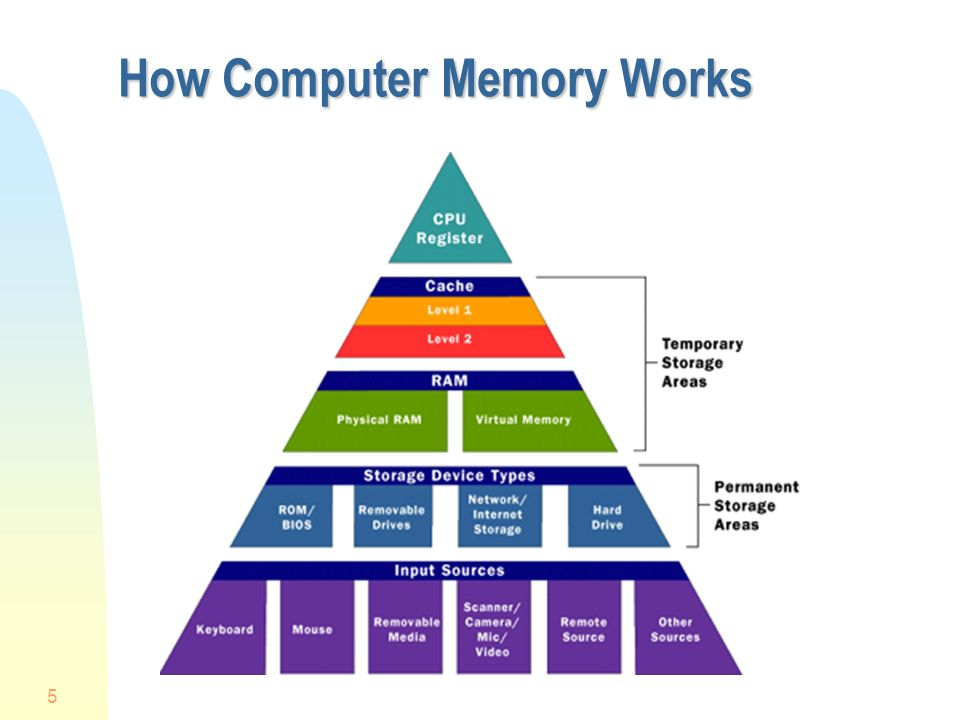

# CS
## PC Hardware
### * PC Structure

 **\* 저장공간**
- Disk : 파일의 저장공간(Program)
- RAM : 실행되는 프로그램들이 작동하는 공간 (Process)
- CPU : 램에서 실행되는 프로그램 연산을 담당한다. (Thread)

 **\* 실행단위**
 - Program : Hard Disk 저장된 실행 파일
- Process : 실행 한 프로그램  
(Program 에서 Process로 실행되며,
SSD에서 RAM으로 이동되는 과정을 로딩이라고 하며, 프로그램 실행 시 발생하는 로드와 같은 개념)
- Thread : CPU에서 해결해야 하는 연산을 처리하는 것

*\- 연산을 처리하는 방법* 
Context Switching : 지역 균형 발전 같은 평균값을 중요시해서 Task를 분할해서 여러 Task를 처리하는 방식
Option-Primary : 균형 처리 방식에서 우선시 되는 Task를 먼저 처리하기 위한 옵션

*\- Process와 비슷한 Object* 
process a = new process, 
process a = new process의 두 객체가 다르듯 RAM에 두 a라는 프로세스가 생성

*\- 주의 사항* 
- 코딩 시 사용하는 static은 ram 위치에 변수를 선언함
- 이와 같은 ram의 변수를 서로 다른 Thread가 변동 시 제대로된 값을 결과로 발생하지 않음 => Thread 충동 에러 발생 원인
- Static 변수는 가능하면 변동 가능성이 없는 값을 사용, const를 병행하여 사용

