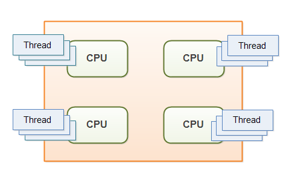

# CS
## PC Hardware
---

### RAM
- Random Access Memory
- 프로그램이 실행되는 동안 필요한 정보를 저장하는 컴퓨터 메모리
- ram은 cpu와 disk의 중간 브로커
- 공간지역성 : 어떤 데이터에 접근 후 근접한 데이터에 다시 접근할 가능성이 높음.
- 시간지역성 : 한 번 접근한 데이터에 다시 접근할 가능성이 높음.
- 램의 효율성 비교 :  
16기가 램 1개(2 X 8), 8기가 램 2개 (1 X 16) 
1 Task가 8개 라면, 둘 다 1 cycle에 처리 가능 
1 Task가 10개 있다면, 같은 용량이지만 2 X 8 의 경우 1 cycle로 다 처리할 수 없다.
- 
---
### CPU
- Core는 물리적인 cpu의 프로세서
- Thread는 core에 붙는 일꾼
- HT, SMT로 실제로는 하나지만 멀티로 보여지게 하는 논리적인 cpu
- 멀티코어가 무조건 좋은가?  
대부분 좋지만, 실행 프로그램의 멀티코어 환경에서의 최적화에 따라 효율이 결정된다.
- 

##### 이미지 참조: 
##### https://t1.daumcdn.net/cfile/tistory/992774365AC9E8CB1D
##### 영상 참조 : 
##### https://youtu.be/Vj2rNQFvdDw
##### https://youtu.be/_dhLLWJNhwY