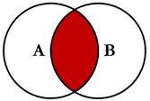
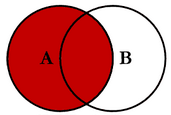
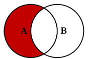
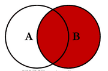
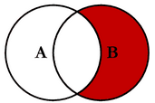
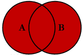
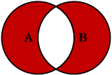

# ✅ JOIN
 
### INNER JOIN
* 조인 하는 테이블의 ON 절의 조건이 일치하는 결과만 출력<br>
* 표준 SQL과 달리 MySQL에서는 JOIN, INNER JOIN, CROSS JOIN 모두 같은 의미로 사용<br>
<br>
* SELECT * FROM tableA A INNER JOIN tableB B ON A.key = B.key;<br>

```
SELECT u.userid, name
FROM usertable AS u INNER JOIN buytable AS b
ON u.userid=b.userid
WHERE u.userid=11;
```
<br>
```
SELECT u.userid, name
FROM usertable u, buytable b
WHERE u.userid=b.userid AND u.userid=11;
```
<br>
 
### LEFT/RIGHT OUTER JOIN
* 두 테이블이 합쳐 질 때 왼쪽/오른쪽을 기준으로 했느냐에 따라 기준 테이블의 것은 모두 출력
* select column명 으로 데이터 선택해서 가져온다.
* OUTER JOIN은 LEFT/RIGHT/FULL OUTER JOIN이 있다.

* LEFT JOIN은 두 테이블이 있는 경우, 첫 번째 테이블을 기준으로 두 번째 테이블을 조합하는 JOIN이다.<br>
<br>
* SELECT * FROM tableA A LEFT JOIN tableB B ON A.key = B.key;<br>

```
SELECT student.name, professor.name
FROM student LEFT OUTER JOIN professor
ON student.classid = professor.classid
WHERE grade = 1;
```
<br>

* EXCLUSIVE LEFT JOIN<br>
<br>
* SELECT * FROM tableA A LEFT JOIN tableB B ON A.key = B.key WHERE B.key IS NULL;<br>

```
SELECT * 
FROM table1 a LEFT JOIN table2 b
ON a.id = b.id
WHERE b.id IS NULL; 
```
<br>

* RIGHT JOIN은 두 테이블이 있는 경우, 두 번째 테이블을 기준으로 첫 번째 테이블을 조합하는 JOIN이다.<br>
<br>
* SELECT * FROM tableA A RIGHT JOIN tableB B ON A.key = B.key;<br>

```
SELECT student.name, professor.name
FROM student RIGHT OUTER JOIN professor
ON student.classid = professor.classid
WHERE grade = 1;
```
<br>

* EXCLUSIVE RIGHT JOIN<br>
<br>
* SELECT * FROM tableA A RIGHT JOIN tableB B ON A.key = B.key WHERE B.key IS NULL;<br>

```
SELECT * 
FROM table1 a RIGHT JOIN table2 b
ON a.id = b.id
WHERE b.id IS NULL; 
```
<br>

* 3중
```
CREATE VIEW allView AS
(
    SELECT a.name, a.countryCode
    FROM city a
    LEFT JOIN country b
    ON a.countryCode = b.code
    LEFT JOIN countrylanguage c
    ON b.code = c.countryCode
    WHERE a.countryCode IN ('KOR');
)
```
<br>

* FULL OUTER JOIN을 대부분 DB가 지원하지 않지만 간접적으로 구현 가능<br>
<br>
```
SELECT *
FROM topic FULL OUTER JOIN author
ON topic.author_id = author.id;
---------------------------------->
(SELECT * 
FROM topic LEFT JOIN author 
ON topic.auther_id = authoer.id)
UNION 
(SELECT * 
FROM topic RIGHT JOIN author 
ON topic.auther_id = authoer.id)
```
<br>

* EXCLUSIVE FULL OUTER JOIN <br>
<br>

### SELF JOIN <br>
* 테이블 자기자신을 조인 <br>

| NO | NAME | PARENT_NO |
| --- | --- | --- |
| 10 | CHOI | 100 |
| 100 | LEE | 1000 |

<br>

```
SELECT A.NAME AS aname, B.NAME AS bname 
FROM PERSON A, PERSON B
WHERE A.PARENT_NO = B.NO;
```
<br>
