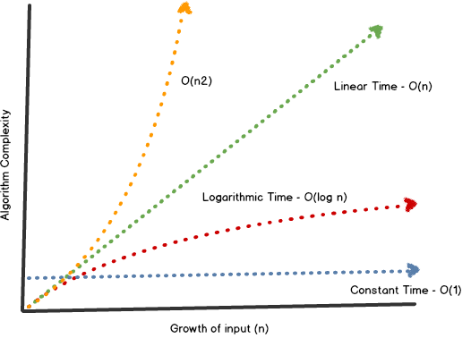

# DS
### Array
---
- 참고 자료  
https://youtu.be/NFETSCJON2M
---
- #### Time Complexity(시간복잡도) 
데이터 구조의 동작 혹은 알고리즘이 얼마나 빠르고 느린지 측정하는 방법 
시간 단위가 아닌 동작 단계(step)으로 측정.

- #### Reading  
인덱스 위치를 알면, 그 위치의 값을 바로 읽어 올 수 있다. (array[1])
- #### Searching  
reading과 다르게 searching은 위치를 알기위해 하는 동작으로, 배열 하나씩 체크해야한다.
- #### Insert  
배열을 만들고 생성할 때는 미리 공간을 확보해야한다.  
배열 맨 앞에 추가할 시 이미 있는 데이터를 다 이동시켜야한다.
- #### Delete  
디스크 조각 모음 처럼 앞, 중간에 삭제하면 이 후 값을 이동시켜야한다. 

---

### 검색 알고리즘

---

https://youtu.be/WjIlVlmmNqs  

---

- #### Linear Search  
순서대로 처음부터 끝까지 검색하는 방법 
배열이 길어질 수록 검색 시간도 오래걸린다.
- #### Sorted Array
정렬하며 데이터를 추가하는것
- #### Binary Search
Sorted Array의 목적이다.  
1~10 까지 있는 배열
찾는 값을 중간값과 비교 Up, Down을 판단 
중간 값인 5와 비교하여 Up의 중간값 7과 비교 다시 Up, Down을 비교. 
작을 시 반대로 비교. 
거대 배열을 다룰 때 효과적

---

### Big O
---
https://youtu.be/BEVnxbxBqi8

---

- #### Big O  
알고리즘의 속도를 나타내는 방법 : 완료까지 걸리는 절차 수
 

- #### 상수 시간 복잡도 
input size에 상관없이 one step으로 끝난다. -> O(1) 
ex)  
print_first(arr); 
print(arr[0]); 
프린트를 2번 한다고 O(2)가 아니다.
인풋사이즈와 함수가 동작하는 Step이 중요하다.

- #### O(n)  
선형 검색 알고리즘의 경우 
반복문 혹은 순서대로 Searching 하는 경우

- #### O(n^2) 
시간복잡도의 Quadratic Time(2차시간) 
Nested Loop(중첩루프)에서 발생 
ex) 구구단

- #### O(log n) 
로그(logarithm) <> 지수(exponent) 
32/2^5 = 1 
n = 5 
이진검색과 방법이 유사하다.

- #### 버블 정렬  
배열의 2개의 아이템을 선택하고 비교-> 값이 큰 쪽을 오른쪽으로 가도록 비교 
사이클마다 n-1번 비교 
시간복잡도 : O(n^2) 
 

- #### 선택 정렬  
전체 아이템중 가장 작은 아이템의 위치를 저장 
첫번째 아이템과 가장 작은 아이템의 위치를 교환 
정렬되지 않은 부분 중 가장 작은 아이템을 찾아 위치 시키는 과정을 반복 
시간복잡도 : O(n^2) 
 

- #### 삽입 정렬  
작은 인덱스부터 시작해서 앞의 자리의 값과 비교하면서 삽입할 자리를 찾아 정렬하는 방법 
index 1부터 시작 
시간복잡도 : O(n) or O(n^2) 
 

- #### Hash Table  
- array는 요소를 찾기위해 선형검색 필요
- hash table의 경우 key를 이용해 value를 찾을 수 있다.
- Hash Table은 내부에 array가 있다.
- 하지만 hash function을 이용해서, array보다 빠르다.

- ##### Hash Function
- key를 숫자로 변환하고, 이 값이 index로 사용해서 value를 찾는다.
- hash function에 다른 key값 대입 후 값은 index를 반환 할 수 있다. 
- 이 상황을 해시 충돌이라고 한다.
