- github 초기화면 
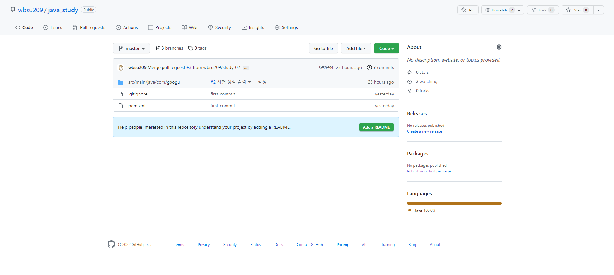 
- issue 화면
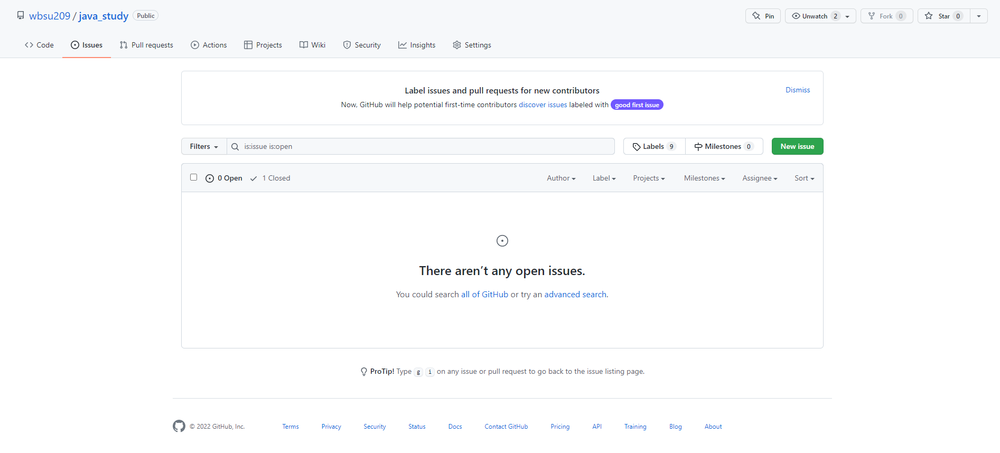 
- issue 태그를 만들어주고(#number), assign으로 할당 인원 지정한다.
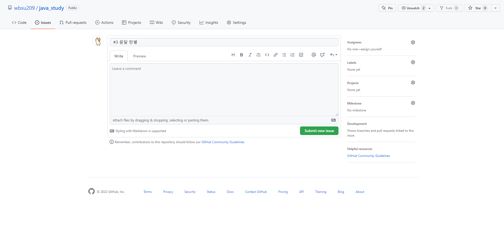 
- issue 생성한다.
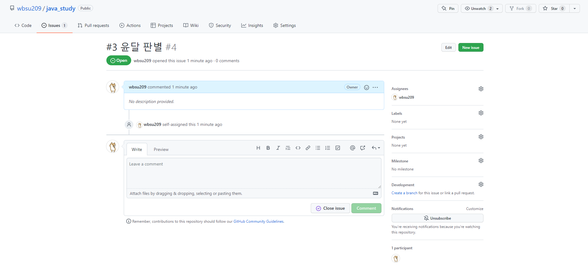 
- issue 관련 작업을 진행한고, 이슈에 맞는 branch를 생성해 푸시한다.
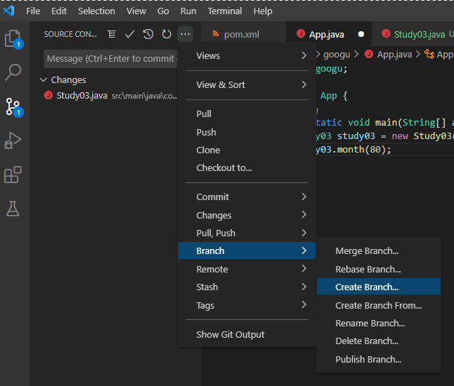 
- commit을 진행하며 issue 태그를 입력해 등록한다.
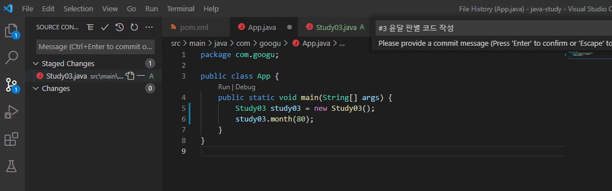 
- push를 진행 하면 github에 request가 생긴다.
 
- pull request 내용을 확인하고 진행한다.
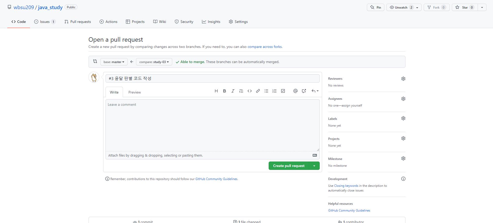 
- merge를 신청한다.
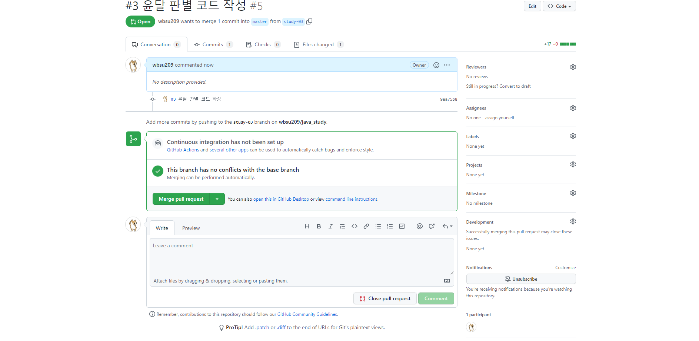 
- merge를 진행한다.
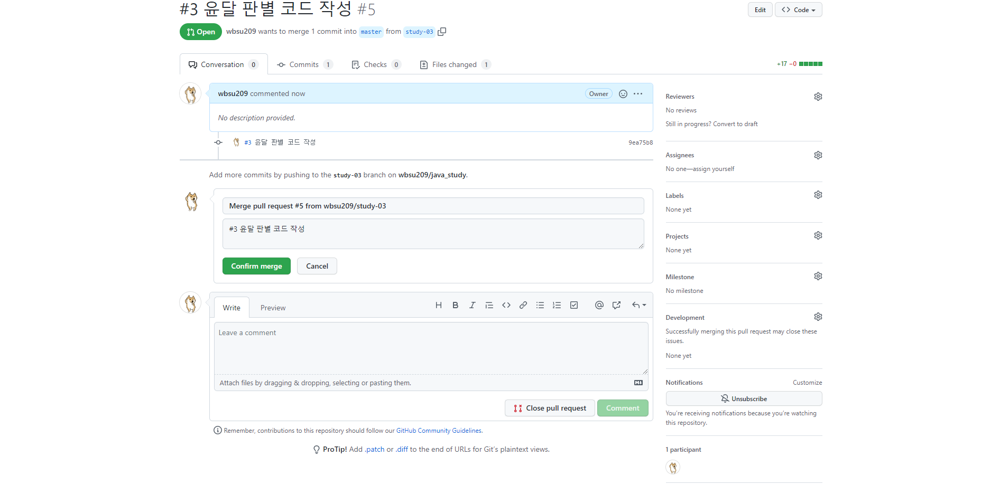 
- merge 완료 화면
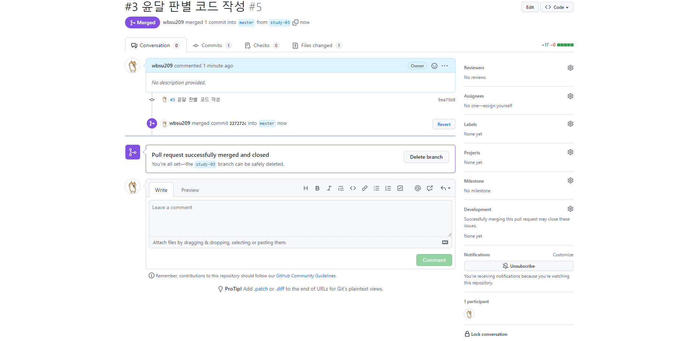 
- issue를 close한다.
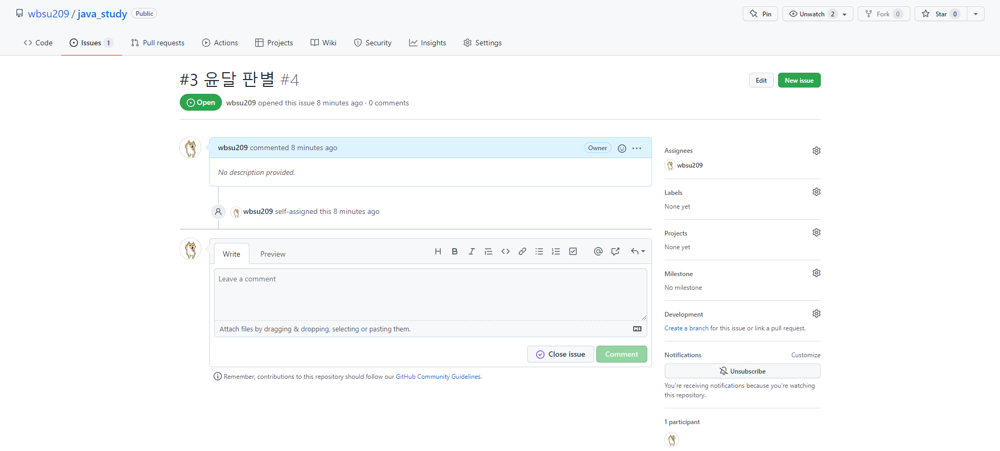 