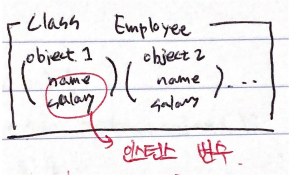
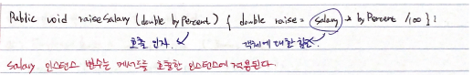
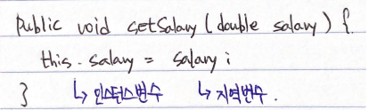
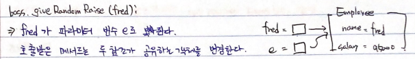
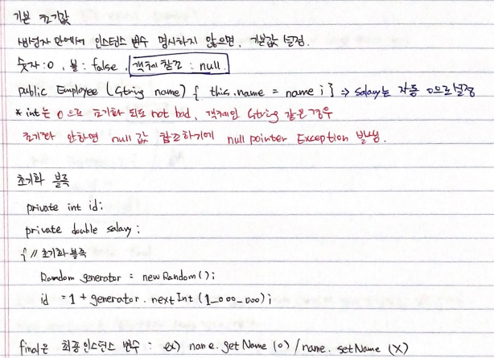
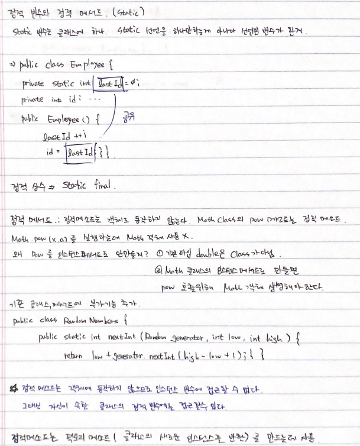

# Hello World
## 객체 지향 프로그래밍
---
int value = date.getDayofWeek().getValue(); 
.date 객체에 getDayofWeek의 메서드 결과인 DayofWeek(객체)이 반환 
. DayofWeek 객체의 메서드인 getValue()의 메서드를 호출하여 int값을 반환한다. 

* 메서드 변경자(mutator) : 호출 대상 객체를 변경하는 메서드 ex)ArrayList.add();
* 메서드 접근자(accessor) : 객체를 변경하지 않는 메서드
--- 

- 객체 참고 : 자바에서는 변수에 오직 객체에 대한 참조를 담을 수 있다. 
ArrayList<String> people = friends; 
people.add("Paul"); 
people, friends의 크기가 2가 된게 아니라, people과 friends가 참조하는 배열리스트의 크기가 2가 된 것.
<pre><code>date = LocalDate.of(year, month, 1);
date = date.plusDays(1);
 //새로운 LocalDate 객체를 돌려줌
 //새로운 객체를 참조한다.
 //첫번째 객체는 가비지 컬렉터로</code></pre>
---
### 클래스 구현하기
<pre><code>public class Employee {
    private String name;
    private double salary;
    ....
}</code></pre> 

  

. 인스턴스 변수 : 클래스 안에 선언한다. 
. 인스턴스 메서드 : 클래스의 인스턴스에 동작한다 ~~~(Static)~~~ 

  

 . this : 객체에 있는 메서드를 호출할 때는 해당 객체를 this로 접급할 수 있다. 

  

<pre><code>public class EvilManager{
    private Rnadom generator;
    public void giveRandomRaise(Employee e){
        double percentage = 10 * generator.nextGaussian();
        e.raiseSalary(percentage);
    }
}</code></pre> 
  
 --- 
 ### 객체 생성 
 - 생성자 : 메서드 선언과 비슷 하지만 이름이 클래스 이름과 같고, 반환 타입이 없다.
 <pre><code>public Employee(String name, double salary){
     this.name = name;
     this.salary = salary;</code></pre>
. 반환 타입을 적으면, 메서드 선언이 된다. 
- 오버로딩(중복정의) 
<pre><code>public Employee(double salary){
    this.name = "";
    this.salary = salary;
}</code></pre>
---
### 기본 초기값 
  
 
 ---
 ### 정적 변수와 정적 메서드(static) 
  