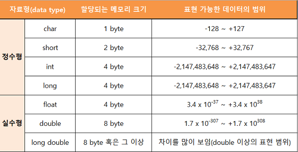

# Hello World
<pre><code>public class HelloWorld {
    public static void main(String[] args) {
        System.out.println("Hello World!!");
    }
}</code></pre>

1. main 메서드 : 프로그램이 실행될 때 첫 번째로 호출되는 메서드.
 - 특정 객체를 대상으로 동작하지 않기 위해 static 선언.
 - main이 호출될 때는 미리 정의된 소수의 객체만 있고, 이 객체는 HelloWorld의 객체가 아니다.
2. System.out.println("Hello World!!");
 - System.out은 객체이자, PrintStream 클래스의 인스턴스다.
 - PrintStream 클래스에는 println, print 등의 메서드가 있다.
 - 이러한 메서드를 인스턴스 메서드라 칭한다 : 해당 클래스의 객체를 대상으로 동작
 - PrintStream(클래스) -> System.out(객체, 클래스 인스턴스) -> println(메서드) 
 ###### cf) Mr.Hong : Hello World가 프로그래밍의 80%라고 하셨다.
 ---
 ## 기본 타입
 ### 가장 간단한 데이터 타입 = 기본 타입
 
 1. 정수타입 
 . int   : 4byte - 32bits  
 . long  : 8byte - 64bits  
 . short : 2byte - 16bits  
 . byte  : 1byte - 8bits  
 - 표현법 
 . 정수 리터럴   : L (300000L)  
 . 16진수 리터럴 : 0x (0xCAFE)  
 . 2진수 리터럴  : 0b (0b1001)  

 2. 부동소수점 타입 
 . float  : 4byte - 32bits 
 . double : 8byte - 64bits 
 - 표현법 
 . float : F (3.14F) 
 cf) 무한대가 숫자가 아니라는 NaN표현 / 반올림 오류 없는 정확한 숫자계산을 위한 BigDecimal

 3. char 타입 
 . UTF016 문자 인코딩의 '코드 유닛(코드 단위)'  
 - 특수 타입 
 . \n : 줄넘김 
 . \r : 출력 위치를 줄 맨 앞으로 옮김 
 . \t : 탭 
 . \b : 백스페이스 

 4. boolean 타입 
 . true 
 . false 

