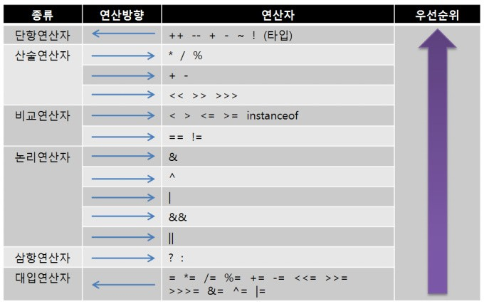

# Hello World
 ## 변수
 ---
 - Random generator = new Random(); 
. 첫 Random은 gernerator의 타입 
. 두 번째 Random은 new 표현식 부분으로 클래스의 객체 생성 

- 변수명 선언 : 낙타 표기법 (iDoNotWantToWork)
- 변수를 선언할 때는 꼭 초기화 해준 후 사용! 
. 이 실수로 참 에러 많이 발생 한다. 
- 변수는 사용하기 직전까지 변수 선언을 늦추는 것을 좋은 방식으로 제안한다. 
. 엄한 곳에 선언해두면 나중에 찾기 어렵다. 
- 상수 선언 : final 최종 선언이다. 
---
## 산술 연산
---
 

 - 할당 연산자 =  
 . 이것도 이름이 있는지를 다시 알았다. 
 . amount -= 10; 는  amount = amount - 10;  
 - 기본 계산 
 . 정수를 0으로 나누면 무한대, 부동소수점을 0으로 나누면 NaN 
 . %은 짝수 0, 홀수 1, 음수면 -1 
 . n++ / n-- : for문에서 정말 많이 사용 
 - 수학 메서드 : Math.max / Math.min 
 . 부호 없는 값을 다루는 compareUnsigned, divdeUnsigned, remainderUnsigned 
 . 일정한 부동소수점 계산을 원할 때, StricMath 클래스 사용 
 - 숫자 타입 변환  
 . 피연산자 중 하나가 double 이면 다른 하나는 double로 변환한다.  
 . 피연산자 중 하나가 float 면 다른 하나는 float로 변환한다.  
 . 피연산자 중 하나가 long 이면 다른 하나는 long 으로 변환한다.  
 . 그 외에는 두 연산자를 int로 변환한다. 
 . byte 에서 short, int, long, double  
 . short와 char에서 int, long, double  
 . int 에서 long, double  
 . 반올림 round  
 - 관계 연산자와 논리 연산자 
 . &&, ||은 단락 평가 첫 번재 조건 값에 따라 다음 조건 평가 안함. 
 . ? 연산자 time < 12 ? "am" : "pm" 지금 프로그램에서 너무 많이 사용되어있다. 
  
 

