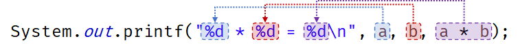
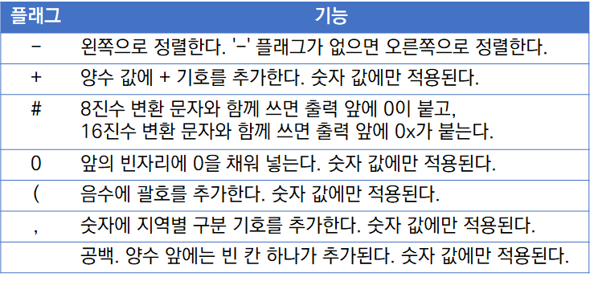
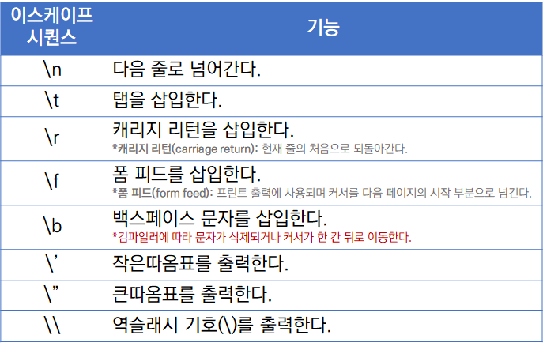

# Hello World
## 입력과 출력
---
### 인수(argument) / 매개변수(parameter)
<pre><code>static void func(int a, int b) {
	// ...
}
int num = 10;
// 여기서 num과 5를 인수(argument)라고 합니다.
func(num, 5);</code></pre>
---
### 입력 읽어오기
 <pre><code>Scanner in = new Scanner(System.in);
 System.out.println("What is your name?");
 String name = in.nextLine();</code></pre>

- nextLine() : 입력된 한줄
- next() : 입력된 단어
- nextInt() : 입력된 정수
- nextDouble() : 입력된 부동소수점
- hasNextLine(), hasNext(), hasNextInt(), hasNextDouble() : 또 다른 줄, 단어, 정수, 부동 소수점 있는지 
<pre><code>if(in.hasNextInt())
{
    int age = in.nextInt()
}</code></pre>
--- 
### 서식 지정 출력
 
- 서식 지정자
 <pre><code>%[플래그][너비][.정밀도]변환문자</code></pre>
 . 너비 : 인수를 출력하기 위해 너비를 지정
 
 . 정밀도 : 부동 소수점 타입과 함께 사용되며, 정밀도를 사용해서 출력될 소수점 수를 지정 
 . 변환 문자 : 변환 문자는 제공한 인수에 대한 타입을 지정하는 문자 
 - 플래그
 
 - 이스케이프 시퀀스
 
---
---
## 제어 흐름
---
### 분기
- if, else if, else
- switch, case, break, default
---
### 루프
- while
- do while
<pre><code> Random generator = new Random();
int next;
do { 
    next = generator.nextInt(10);
    count++;
} while (next != target);</code></pre>

- for 
. for(;;) //무한 루프 

---
### 중단과 계속
- break : 당장 루프 빠저나온다.
- continue : 다음 동작 넘기고, 루프문 일땐 다음 루프로 (i++)
- 레이블 break
<pre><code>outer:
while(...){
    ...
    while(...){
        ...
        if(...) break outer;
        ...
    }
    ...
}
// 레이블 break 여기로 나온다.</code></pre>
---
### 지역 변수의 유효 범위
- 지역 변수 해당 생성된 블록의 범위 {}
