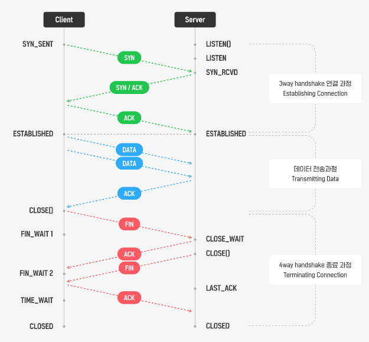

## HTTP (Hyper Text Transfer Protocol)
---
 인터넷에서 데이터를 주고받는 프로토콜 
 주고 받는 데이터는 HTML, 평문, JSON 등 다양한 포맷이 가능하다. 
 TCP 위에서 동작하지만 TCP와는 달리 무상태성, 비연결성이다. 
 쿠키나 세션을 이용하여 클라이언트의 상태를 관리 
 

---
* 비연결성(Connectionless)
    * 비연결성은 클라이언트와 서버가 한 번 연결을 맺은 후, 클 라이언트 요청에 대해 서버가 응답을 마치면 맺었던 연결을 끊어 버리는 성질
    * 장점
        * HTTP는 불특정 다수와 통신하는 특징 때문에, 연결을 유지하기 위한 리소스를 줄이면 더 많은 연결을 할 수 있다.
    * 단점
        * 매번 새로운 연결을 시도/해제의 과정을 거쳐야하므로 연결/해제에 대한 오버헤드가 
        발생한다.
    * KeepAlive
        * KeepAlive는 지정된 시간동안 서버와 클라이언트 사이에서 패킷 교환이 없을 경우, 상대방의 안부를 묻기위해 패킷을 주기적으로 보내는것
        * 주기적으로 클라이언트의 상태를 체크한다는 것으로 미루어보아 KeepAlive 역시 완벽한 해결책은 아니다.
        * KeepAlive 속성이 On 상태라해도, 서버가 바쁜 환경에서는 프로세스 수가 기하급수적으로 늘어나기 때문에 KeepAlive로 상태를 유지하기 위한 메모리를 많이 사용하게 되므로 주의해야 한다.
* 무상태 (Stateless)
    * Connectionless로 인해 서버는 클라이언트를 식별할 수가 없는데, 이를 Stateless라고 하고, 이 때문에 매번 새로운 인증을 하거나 확인을 받아야한다.
    * 상태 기억 방법 - 쿠키
        * 브라우저 단에서 쿠키라는 것을 저장하여 서버가 클라이언트를 식별할 수 있도록 한다.
    * 상태 기억 방법 - 세션
        * 쿠키는 사용자 정보가 브라우저에 저장되기 때문에 공격자로부터 위변조의 가능성이 높아 보안에 취약한 단점을 갖는다.
        * 세션은 브라우저가 아닌 서버단에서 사용자 정보를 저장하는 구조
        * 세션을 사용하면 서버에 사용자 정보를 저장하므로, 서버의 메모리를 차지하게 되고, 만약 동시 접속자 수가 많은 서비스일 경우에는 서버 과부화의 원인이 된다.
    * 상태 기억 방법 - 토큰
        * 토큰 기반의 인증 방식의 핵심은 보호할 데이터를 토큰으로 치환하여 원본 데이터 대신 토큰을 사용
        * 중간에 공격자로부터 토큰이 탈취당하더라도 데이터에 대한 정보를 알 수 없으므로, 보안성이 높다.
        * 대표적으로는 OAuth와 JWT이 있다.

