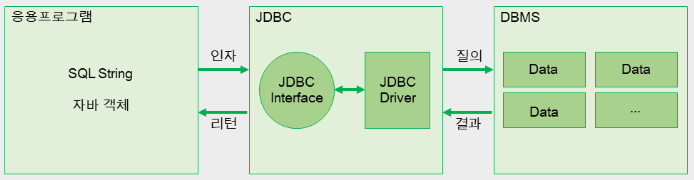
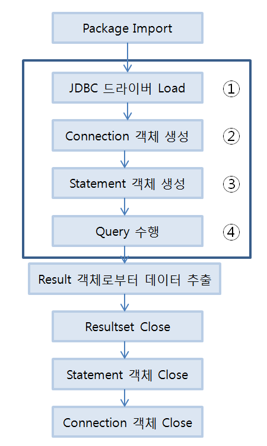

# ✅ JDBC (Java Database Connectivity)

## JDBC ?
* 자바에서 DB와 연결되어 데이터를 주고 받을 수 있게 해주는 프로그래밍  인터페이스<br>

## JDBC 역할
* 응용프로그램과 DBMS간의 통신을 중간에서 번역해주는 역할
<br>

## JDBC를 이용한 DB 연동 과정
<br>

1. JDBC 드라이버 로드
```
Class.forName("com.mysql.Jdbc.Driver"); 
```
2. DB 연결
```
String jdbc_url = "jdbc:mysql://localhost:3306/datebase?serverTimezone=UTC";
Connection con = DriverManager.getConnection(URL, "user", "password");
```
3. SQL을 위한 객체 생성
```
Statement stmt = con.createStatement(); 
```
4. SQL 문장 실행
```
String sql = "select * from student";
ResultSet result = stmt.executeQuery(sql);  
```
5. 질의 결과 처리
```
while(result .next()){       
    String id = result .getString(1);
    String name = result .getString(2);
    String class = result .getString(3);
}
//ResultSet 인터페이스에는 질의 결과의 현재 행(row)을 가리키는 커서(cursor)라는 개념이 있으며, 
//이 커서를 다음 행으로 이동시키는 메소드가 next()이다.  
```