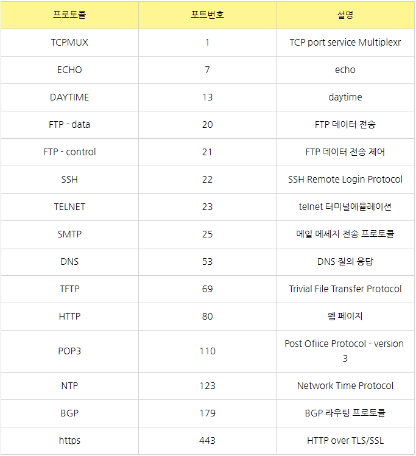

### PORT
---
* 0 ~ 1023 : 잘 알려진 포트 (well-known port)
    * ICANN에서 할당한 포트
    * 강제는 아님
* 1024 ~ 49151 : 등록된 포트 (registered port)
    * 특정 용도로 사용되기 위해 등록된 포트
    * 강제는 아님
* 49152 ~ 65535 : 동적 포트 (dynamic port)
    * 어느 프로그램에서나 사용 가능

 