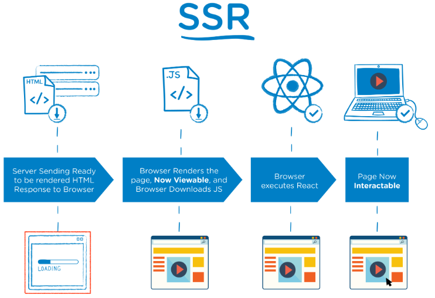

# ✅ SSR (Server Side Rendering)

## SSR 정의
```
Server Side Rendering의 약자.

서버쪽에서 렌더링 준비를 끝마친 상태로 클라이언트에 전달하는 방식이다.
```

## SSR 절차
1. User가 Website 요청을 보냄.<br>
2. Server는 'Ready to Render'. 즉, 즉시 렌더링 가능한 html파일을 만든다.<br>
    (리소스 체크, 컴파일 후 완성된 HTML 컨텐츠로 만든다.)<br>
3. 클라이언트에 전달되는 순간, 이미 렌더링 준비가 되어있기 때문에 HTML은 즉시 렌더링 된다. <br>
    그러나 사이트 자체는 조작 불가능하다. (Javascript가 읽히기 전이다.)<br>
4. 클라이언트가 자바스크립트를 다운받는다.<br>
5. 다운 받아지고 있는 사이에 유저는 컨텐츠는 볼 수 있지만 사이트를 조작 할 수는 없다. <br>
    이때의 사용자 조작을 기억하고 있는다.<br>
6. 브라우저가 Javascript 프레임워크를 실행한다.<br>
7. JS까지 성공적으로 컴파일 되었기 때문에 기억하고 있던 사용자 조작이 실행되고, 웹 페이지는 상호작용 가능해진다.<br>

<br>

# ✅ CSR (Client Server Rendering)

## CSR 정의
```
Client Side Rendering의 약자.

서버는 요청을 받으면 클라이언트에 HTML과 JS를 보내준다. 
클라이언트는 그것을 받아 렌더링을 시작한다.
```

## CSR 절차

1. User가 Website 요청을 보냄.<br>
2. CDN이 HTML 파일과 JS로 접근할 수 있는 링크를 클라이언트로 보낸다.<br>
    (CDN : 엔드 유저의 요청에 '물리적'으로 가까운 서버에서 요청에 응답하는 방식)<br>
3. 클라이언트는 HTML과 JS를 다운로드 받는다.<br>
    (이때 SSR과 달리 유저는 아무것도 볼 수 없다.)<br>
4. 다운이 완료된 JS가 실행된다. 데이터를 위한 API가 호출된다.<br>
    (이때 유저들은 placeholder를 보게된다.)<br>
5. 서버가 API로부터의 요청에 응답한다.<br>
6. API로부터 받아온 data를 placeholder 자리에 넣어준다. <br>
    페이지는 상호작용이 가능해진다.<br>

<br>

---

* CDN : (Content Delivery Network) 
    - 지리적으로 분산된 여러 개의 서버입니다. 
    - 웹 콘텐츠를 사용자와 가까운 곳에서 전송함으로써 전송 속도를 높입니다. 
    - 전 세계 데이터센터는 파일 복사본을 임시로 저장하는 프로세스인 캐싱을 사용합니다. 
    - 사용자는 가까운 서버를 통해 웹 활성화 디바이스 또는 브라우저에서 인터넷 콘텐츠에 빠르게 접속할 수 있습니다. 
    - CDN은 웹 페이지, 이미지, 비디오 등의 콘텐츠를 사용자의 물리적 위치와 가까운 프록시 서버에 캐싱합니다. 