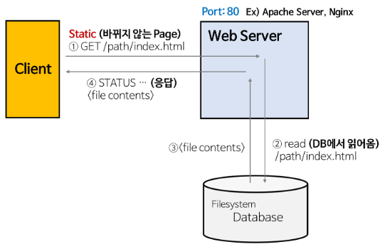
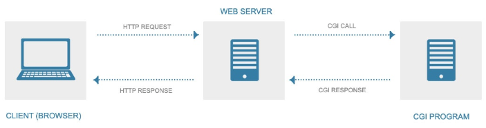
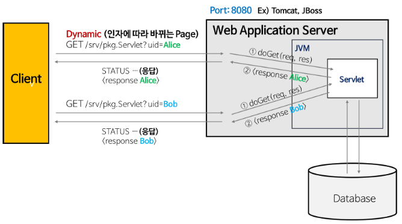

## Web Service Architecture
---
 

---

### Static Page(정적 페이지) 
 
* Web Server의 개념
    * 정적인 컨텐츠를 제공한다. (정적인 컨텐츠 : html, css)
    * 클라이언트의 요청을 받아서 돌려준다.
* Web Server의 기능
    * HTTP 기반으로 하여 클라이언트의 요청에 대한 서비스를 담당한다.
    * 정적인 컨텐츠 제공 (WAS에 요청을 전달하지 않고 바로 제공)
    * 동적인 컨텐츠 제공을 위해 WAS에 요청 전달
* Web Server의 종류
    * Apache Server : Apache
        * 쓰레드와 프로세스 기반 구조 (요청이 많을수록 CPU와 메모리 사용이 증가 -> 성능 저하 가능)
        * 대부분의 OS에서 사용 가능
        * Multi-Processing-Modules(MPMs)
            * MPM_prefork
                * 하나의 자식프로세스가 하나의 쓰레드를 갖는 구조
                * 프로세스가 생성되는 구조이므로 worker보다 많은 메모리를 사용
                * 프로세스간 메모리를 직접 공유하지 않아 메모리 공간이 독립적이므로 안정적임
                * 응답프로세스를 미리 띄워놓고 클라이언트 요청시 자식 프로세스가 반응하게 되는 방식

            * MPM_worker
                * 자식 프로세스들이 각각 여러 쓰레드를 사용할 수 있음
                * 각 쓰레드는 한번에 한 연결을 담당
                * Prefork보다 메모리 사용량이 적고 통신량이 많은 서버에 적절
                * 쓰레드간 메모리 공간을 공유하는데 리소스 경합이 발생하지 않도록 주의가 필요
    * Nginx : Nginx
        * 보안과 속도를 최적화 시키고자 탄생한 웹서버
        * 비동기 Event-Driven 기반 구조
        * 고정된 프로세스만 생성하고 해당 프로세스 내부에서 비동기 방식으로 효율적으로 작업을 처리
        * 동시접속이 많아도 프로세스 또는 쓰레드 생성 비용이 존재하지 않음
        * 규모가 작고 정적 데이터 처리가 많은 서비스에 적합
        * 더 적은 쓰레드로 클라이언트의 요청을 처리할 수 있음 -> 메모리 사용량, CPU 소모 적음
        * 모듈개발이 어렵고 모듈이 다양하지 않음
        * Apache와 비교 
            * Nginx는 비동기 이벤트 기반 / Apache는 요청당 생성 쓰레드, 프로세스 기반
            * Apache에 비해 모듈이 적음
            * 대량 접속에 적은 리소스로 빠른 처리를 할 수 있음
            * Apache는 안정성 확장성, 호환성이 우세함
    * IIS(Internet Information Server) : Microsoft
        * Window전용 웹서버로 Windows에서만 사용가능
        * 검색 엔진, 스트리밍 오디오, 비디오 기능이 포함되어 있음
        * ASP.net 스크립트 언어를 사용할 수 있음
        * 간편한 GUI를 통해 사용 가능함
        * 윈도우 버전마다 기능에 차이가 있음
        * Apache에 비해 속도가 느림
    * WebToB : Tmax Soft
        * 프로세스 처리방식
        * 주로 WAS제품인 제우스(JEUS)와 함께 사용됨
        * 각 프로세스에게 역할을 분담(WSM, HTL, HTMLS, PHPS, CGIS, SSIS...)
        * 각각의 HTML, SSI, CGI 등의 서비스들을 별도의 독립적인 프로세스로 설정하여 프로세스의 수를 조정하여 시스템 부하를 줄임
        * Caching : 자주 이용되는 Resource들을 메모리에 상주시켜놓음
        * WBAPI : 
            * 기존 비효율적으로 설계된 CGI program들을 변환하는데 이용가능
            * Data 의 확장자를 임의로 설정가능하여 자신만의 확장자를 만들 수 있음
                * CGI (Common Gateway Interface)
                    * 말 그대로 인터페이스
                    * 서버와 어플리케이션 간에 데이터를 주고 받는 방식
                     

---

### Dynamic Page(동적 페이지) 
 

* WAS의 개념( Web Application Server)
    * DB 조회나 다양한 로직 처리를 요구하는 동적 컨텐츠를 제공하기 위한 서버
    * HTTP를 통해 컴퓨터나 장치에 애플리케이션을 수행해주는 미들웨어.
    * Web Container 또는 Servlet Container라고 불린다.
    * Container는 JSP, Servlet을 실행시킬 수 있는 소프트웨어를 말한다.
    * WAS는 JSP, Servlet 구동 환경이다.
* WAS의 역할 (WAS = Web server + Web Container)
    * 기능의 분산 환경에서 사용된다.
    * DB 서버와 같이 수행된다.
* WAS의 기능
    * 프로그램 실행 환경과 DB 접속 기능 제공
    * 여러 개의 트랜잭션 관리 기능
    * 비지니스 로직 수행
* WAS의 종류
    * Tomcat : Apache
        * 주요기능
            * JSP/Servlet Container중 하나로 사용자에게 JSP요청을 받으면 서블릿으로 바꾸어 실행
            * JSP 페이지를 웹서버에 요청하면 이 페이지를 해석하고 실행
            * Web Server에서 요청한 동적 페이지를 읽어 프로그램을 실행
            * 결과를 다시 HTML로 재구성하여 Web Server에게 전달
        * 특징
            * Servlet Container를 지원함
            * 플랫폼에 제약이 없음(Windows, Linux, Unix)
            * Tomcat내부에 Web Server와 Web Container의 기능이 들어있으므로 Tomcat이 Apache를 포함하고 있음
                * Tomcat에 Apache가 내장되어있음에도 불구하고 Apache와 Tomcat을 연동하는 이유?
                    * 정적 컨텐츠 서비스 효율이 뛰어남
                    * 유연한 클러스터링
                    * 아파치 웹서버의 모듈 확장성
                    * 보안
    * WebSphere : IBM
        * Java 기반의 웹어플리케이션 서버
        * 서비스 지향 아키텍처(SOA), 모듈식 애플리케이션의 기반
        * 마이크로 서비스 및 표준 기반 프로그래밍 모델을 지원
    * Weblogic :Oracle
        * 유료 서비스로 기술지원이 가능
        * 전체 Java EE 및 Jakarta EE 지원
        * 2EE(자바 2 플랫폼, 엔터프라이즈 에디션)를 가장 잘 지원하는 제품
        * 대부분의 클라우드 환경에서 Java 어플리케이션 실행을 지원(Oracle Cloud Infrastructure, Docker, Microsoft Azure...
        * 풍부한 관리도구와 API로 인해 운영이 자동화
    * Boss(Wildfly) :RedHat
        * RedHat의 오픈소스 프로그램으로 Java EE 전체 스택 지원이 되는 서버 (EJB, JMS, CDI, JTA, Servlet API 등을 지원)
        * Tomcat보다 무거움, Java EE가 제공하는 모든 기능을 필요로할 때 사용
