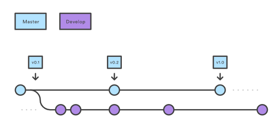
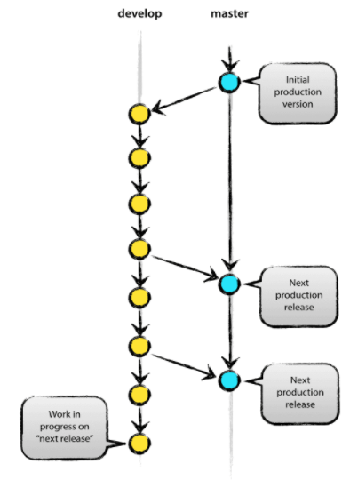
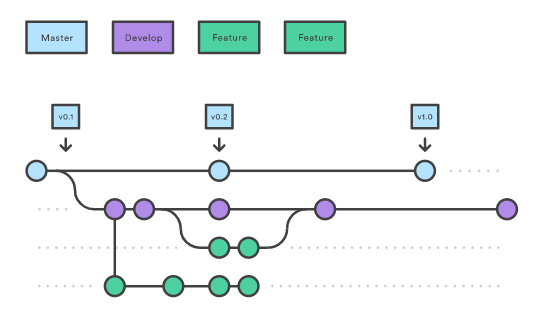
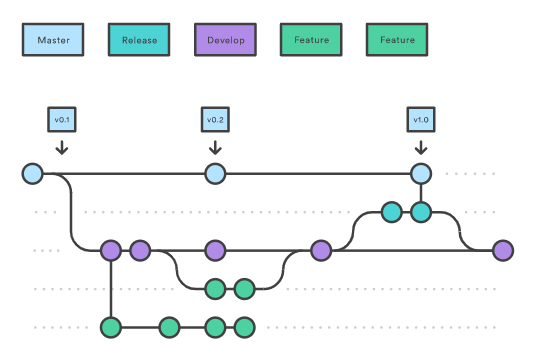
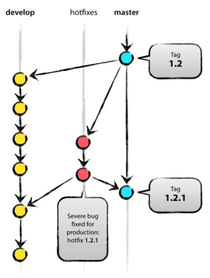

## 2022-04-07 
---

15. Java Version 차이점 : 카테고리 분류하여 정리 예정 

16. 언어, 산업 트렌드 
https://contents.premium.naver.com/codetree/funcoding/contents/211229183444416eH
 
 
https://programmers.co.kr/pages/2022-dev-survey?utm_source=mailchimp&utm_medium=email&utm_campaign=dev-survey&utm_content=2022-dev-survey#dev-part-1-01
 

---
17. 깃 브랜치 종류 

 

1) Master Branch :  

 

.제품으로 출시 될 수 있는 브랜치
.배포 이력을 관리하기 위해 사용, 즉 배포 가능한 상태만 관리 

2) Develop Branch :  

 

.다음 출시 버전을 개발하는 브랜치 

.기능 개발을 위한 브랜치들을 병합하기 위해 사용. 즉 모든 기능이 추가되고 버그가 수정되어 배포 가능한 안정적인 상태라면 develop 브랜치를 master 브랜치에 병합 한다. 

3) Feature Branch :  

 

.기능을 개발하는 브랜치 

.새로운 기능 개발 및 버그 수정이 필요할 때마다 develop 브랜치로부터 분기 한다. 

.feature 브랜치에서의 작업은 기본적으로 공유 필요 없기에, 자신의 로컬 저장소에서 관리한다. 

4) Release Branch :  

 

.이번 출시 버전을 준비하는 브랜치 

.베보를 위한 전용 브랜치를 사용 

.한 팀이 해당 배포를 준비하는 동안 다른 팀은 다른 배포를 위한 개발을 계속 진행 할 수 있다. 

5) Hotfix Branch :  

 

.출시 버전에서 버그를 수정 하는 브랜치 

.버그 수정만을 위한 hotfix 브랜치를 따로 만들기에, 다음 배포를 위해 개발하던 작업 내용에 영향을 주지 않는다. 
