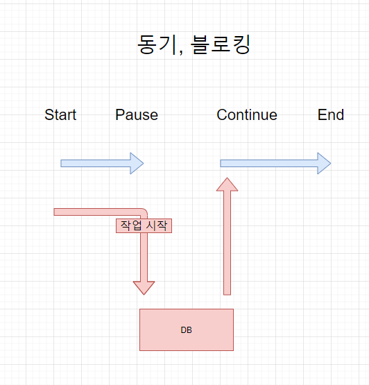
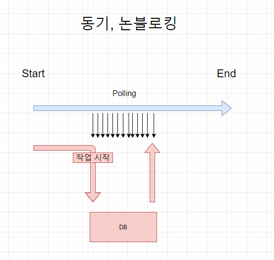
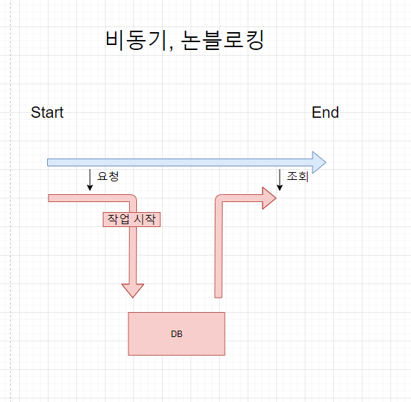

## 2022-07-06
---
#### Socket 통신

### 동기 비동기는 절차상의 개념 
### 블럭 논블럭은 구현상의 개념 

* 동기 : 요청에 대한 답변을 바로 받는것 
+호출된 함수의 수행 결과 및 종료를 호출된 함수 뿐 아니라 호출한 함수도 함께 신경쓰면 동기 
* 비동기 : 요청 후 답변이 올때 까지 기다리지 않는것 
+호출된 함수의 수행 결과 및 종료를 호출된 함수 혼자 직접 신경쓰고 처리하면 비동기이다. 
* 블로킹 : 호출된 함수가 자신이 할 일을 모두 마칠 때까지 제어권을 계속 가지고서 호출한 함수에게 바로 return하지 않으면 블럭이다. 
* 논블로킹 : 호출된 함수가 자신이 할 일을 마치지 않았더라도 바로 제어권을 바로 return하여 호출한 함수가 다른 일을 진행할 수 있도록 하면 넌블럭이다. 

 

* 동기 & 블로킹 
 

* 비동기 & 블로킹 
 

* 동기 & 논블로킹 
 

* 비동기 & 논블로킹 
 

* 참고 사이트 : https://velog.io/@leehyunho2001/동기-비동기-블럭-넌블럭 